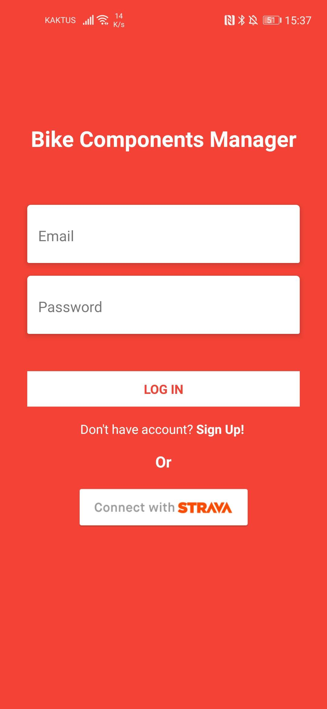
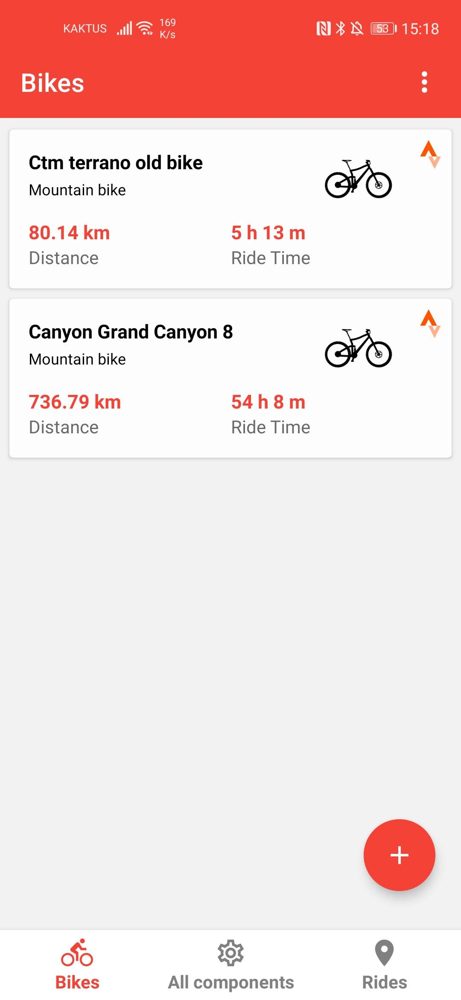
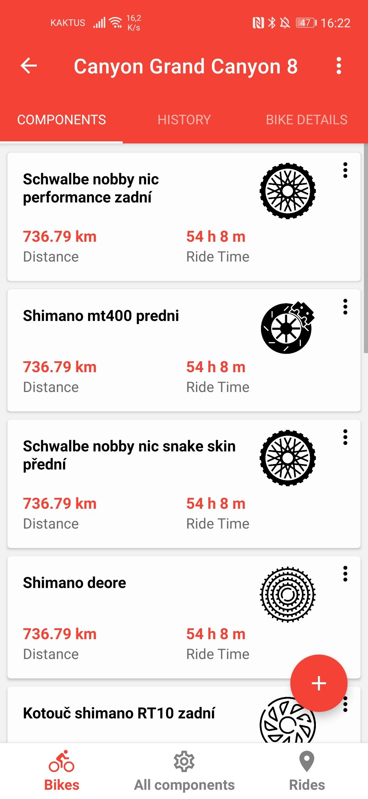
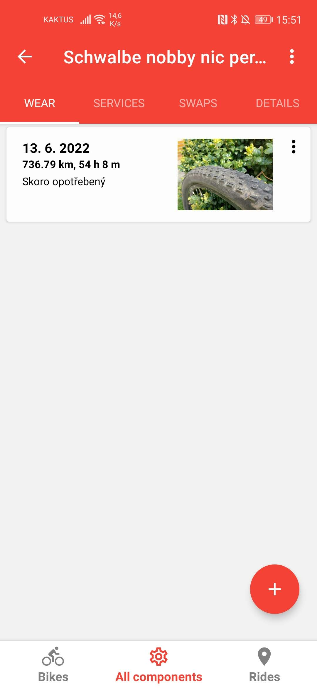
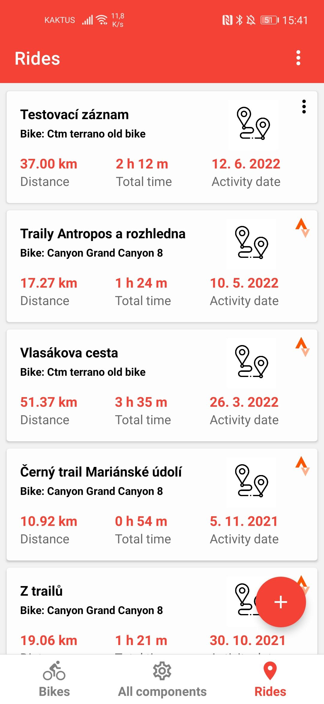

# Bike Components Tracker

Android app for tracking wear and service history of bicycle components.

Every ride adds mileage and ride time to the bike **and** to each component installed on it at that moment — so you always know how far a chain, a cassette or a fork has actually gone, across bike swaps, reinstalls and retirements. Rides are entered manually or synced automatically from **Strava**.

Built with React Native (Expo), TypeScript and Firebase.

---

## Screenshots

| Sign in | Bikes | Components on a bike |
|---|---|---|
|  |  |  |

| Wear records | Rides |
|---|---|
|  |  |

---

## Features

- **Bikes** — MTB / gravel / road / other, with brand, model, purchase date and starting mileage. Retire and reactivate.
- **Components** — chains, cassettes, chainrings, derailleurs, brakes, discs, pads, forks, rear suspension, rims, seats, seatposts, tires and custom types. Each keeps its own distance and ride-time counters, plus an initial mileage for second-hand parts.
- **Install / uninstall history** — mount a component on a bike at a chosen date, remove it later, move it to another bike. Overlapping installations, future dates and installs predating the bike's purchase are rejected.
- **Automatic stats** — installing backfills everything ridden on that bike since the install date; uninstalling subtracts what came after. Editing or deleting a ride recalculates every affected bike, component, service and wear record.
- **Service records** — description, price and date, stamped with the component's mileage and ride time at that moment.
- **Wear records** — description plus an optional photo uploaded to Firebase Storage, stamped the same way.
- **Rides** — manual entry, or Strava import with elevation, average/max speed and elapsed time.
- **Strava integration** — sign in with Strava or link it to an existing account; two-way ride reconciliation (added, updated, deleted), gear-to-bike mapping, retired-gear handling.

## Tech stack

| Layer | Choice |
|---|---|
| App | React Native 0.74, Expo SDK 51, TypeScript |
| Navigation | React Navigation — bottom tabs, native stack, top tabs |
| UI | React Native Paper, vector icons, popup menu |
| Forms | React Hook Form |
| Backend | Firebase — Auth (email/password), Firestore, Cloud Storage |
| External API | Strava API v3 via `expo-auth-session` + axios |
| Builds | EAS Build (Android) |

No custom backend — the app talks to Firestore and the Strava API directly.

---

## Getting started

### 1. Prerequisites

- **Node.js 18+** and npm
- **EAS CLI** ≥ 12.4.1 — `npm install -g eas-cli` (needed for on-device builds)
- An **Expo account** (`eas login`)
- A **Firebase project**
- A **Strava API application**

### 2. Clone and install

```bash
git clone https://github.com/Jkotoun/BP-Bike_Components_Tracker.git
cd BP-Bike_Components_Tracker
npm install
```

### 3. Set up Firebase

In the [Firebase console](https://console.firebase.google.com/), create a project and then:

1. **Authentication** → enable the **Email/Password** provider. (Strava login also runs through it: a Strava athlete gets a derived `<athleteId>@stravauser.com` account, so both login paths share one user model.)
2. **Firestore Database** → create a database. Collections are created on demand; no seed data is needed.
3. **Storage** → enable it (wear-record photos are uploaded there).
4. **Project settings** → add a **Web app** and copy its config values — these are what the app reads at runtime.

> The app initializes Firebase from environment variables through the JS SDK, so the committed `google-services.json` is not used by the current build and does not need to be replaced. It only becomes relevant if native Firebase modules are added later.

### 4. Set up the Strava API application

At [strava.com/settings/api](https://www.strava.com/settings/api), create an application and note the **Client ID** and **Client Secret**. The app opens Strava's mobile OAuth endpoint and returns to the custom scheme declared in `app.config.js`:

```
bikecomponentsmanager://redirect
```

Requested scopes: `profile:read_all`, `activity:read_all`.

### 5. Configure environment variables

```bash
cp envtemplate .env
```

Fill in `.env` — the `EXPO_PUBLIC_` prefix is required, that is how the values reach the bundle:

```
EXPO_PUBLIC_FIREBASE_API_KEY=
EXPO_PUBLIC_AUTH_DOMAIN=
EXPO_PUBLIC_PROJECT_ID=
EXPO_PUBLIC_STORAGE_BUCKET=
EXPO_PUBLIC_MESSAGING_SENDER_ID=
EXPO_PUBLIC_APP_ID=
EXPO_PUBLIC_MEASUREMENT_ID=
EXPO_PUBLIC_STRAVA_APP_CLIEND_ID=
EXPO_PUBLIC_STRAVA_APP_SEC=
```

`.env` is gitignored. Note the typo in `STRAVA_APP_CLIEND_ID` — it is spelled that way in the code, so keep it.

### 6. Build a development client and run

The app depends on native modules and a custom URL scheme, so **Expo Go will not work** — you need a development build once:

```bash
npm run android_prebuild   # eas build --profile development --platform android
```

Install the resulting APK on a device or emulator, then start the bundler:

```bash
npm run dev                # npx expo start
```

and open the app from the development client.

### 7. Firestore indexes

Several queries combine an equality filter with a range or ordering (rides by bike and date, component swaps by install time, service and wear records by date). On first use Firestore rejects those and logs a link that creates the required composite index — open each link once and the queries start working.

### Build scripts

| Command | What it does |
|---|---|
| `npm run dev` | Start the Expo dev server |
| `npm run android_prebuild` | EAS development-client build |
| `npm run android_apkbuild` | EAS preview build, installable APK |
| `npm run android_prodbuild` | EAS production build (auto-increments version) |

---

## How it works

### Data model (Firestore)

| Collection | Purpose |
|---|---|
| `users` | Profile, Strava connection flags, OAuth tokens |
| `bikes` | Bike, type, purchase date, cumulative `rideDistance` / `rideTime`, optional `stravaId` |
| `components` | Component, type, current bike reference, cumulative distance/time, initial values |
| `bikesComponents` | Install/uninstall log — one document per mounting period (`bike`, `component`, `installTime`, `uninstallTime`, note) |
| `rides` | Distance, time, bike reference, optional Strava metadata |
| `componentServiceRecords` | Description, price, date and the component's stats at that date |
| `componentWearRecords` | Description, optional Storage image path and the component's stats at that date |

### Mileage propagation

`bikesComponents` is the source of truth for *what was mounted when*. Adding a ride resolves the components installed on that bike at the ride's timestamp and increments each one; service and wear records dated after that timestamp are corrected too, so editing history stays consistent. Deletions and uninstalls reuse the same path with negative increments, which keeps the whole recalculation in one place — `App/modules/firestoreActions.ts`.

### Strava sync

Runs on login for Strava-linked accounts and on demand from the bikes, components and rides screens:

1. Refresh the access token if expired (tokens live in the user document).
2. Sync gear → bikes: create, update, retire.
3. Page through `athlete/activities`, keep rides, then add / update / delete synced rides and re-run mileage propagation for each change.

## Project structure

```
App.tsx              app entry, auth context provider
Root.tsx             auth gate, tab/stack navigators, sync-on-login
context.tsx          authenticated-user React context
App/config/          Firebase initialization
App/modules/         firestoreActions.ts (data layer), stravaApi.ts, icon maps, helpers
App/screens/         screens and per-tab navigation stacks
App/components/      reusable cards — component, ride, service, wear, swap
App/assets/          app icon and component/bike artwork
```

## Limitations

- Android is the only maintained target; iOS has nothing beyond Expo defaults.
- Firestore security rules are not part of this repository — a deployment needs its own.
- The Strava client secret is bundled into the app. Fine for a personal build; a public release should move the token exchange behind a proxy.
